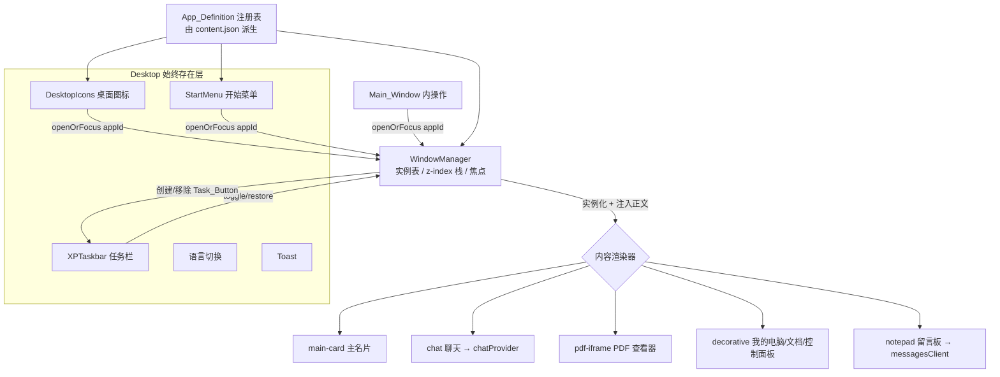
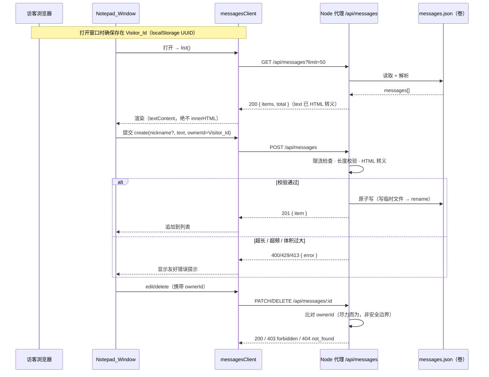

# 设计文档

## Overview

本设计将现有的"单页静态名片"升级为一个可交互的虚拟 Windows XP 桌面：在已完成的桌面外壳（Luna 主题、像素 Bliss 壁纸、任务栏、开始菜单）之上，引入一个**数据驱动的窗口管理器（WindowManager）**，并新增桌面图标、主窗口（培文的名片，系统属性风格）、AI 聊天窗口、三个 PDF 查看器窗口、三个装饰性窗口，以及一个**公共留言板（记事本窗口）**。

### 技术选型与理由（实现者自由决策的结果）

需求文档明确把全部技术选型交给实现者。我们的取舍原则是：**最简单、最内聚、部署不变复杂**。基于对现有代码库的核对，决策如下：

| # | 决策 | 理由（已对照现有代码核实） |
|---|------|------|
| 1 | **保留 Astro 4 静态输出 + 原生 ES 模块**，不引入任何新前端框架或新运行时依赖 | `site/astro.config.mjs` 为 `output: 'static'`；现有 i18n（`scripts/i18n.js`）、复制（`scripts/copy.js`）、SSE 流式聊天（`chat/provider.js`）均为零依赖原生实现且工作良好。引入 React/Vue 等会破坏"部署简单"与既有行为，收益不足。 |
| 2 | **窗口管理器用单个原生 JS `WindowManager` ES 模块**，通过 `App_Definition` 注册表数据驱动（Req 18） | 与现有 `scripts/*.js` 模块风格一致；窗口行为（拖动、聚焦、最大化）是命令式 DOM 操作，原生 JS 最直接，避免框架虚拟 DOM 与窗口绝对定位/层级管理的摩擦。 |
| 3 | **留言板后端：扩展现有零依赖 Node 代理**（`proxy/server.js`），用 `node:fs` 的 JSON 文件存储（`messages.json`），零 npm 依赖（Req 20 + 17） | 现有代理已是零依赖 `node:http` 服务，已实现 `.env` 加载、按 IP 限流、CORS、SSE 透传。在同一进程内加几个 REST 端点 + 文件存储，最大化复用、不增运维面。引入数据库会显著抬高部署复杂度。 |
| 4 | **桌面图标 / 开始菜单 / 主窗口操作三套入口共用同一 `App_Definition` 注册表**（Req 18.5、21.5） | 单一事实来源，避免三处重复维护启动逻辑。 |
| 5 | **沿用 `content.json` 作为唯一内容来源 + 既有 `data-i18n` 机制**（Req 15、17.3） | `i18n/strings.js`、`data/site.js` 已从 `content.json` 派生；新增窗口/图标/菜单文案只需扩展该文件。 |

### 一个真正的架构变化（务必显式标注）

这是本次唯一实质性的架构演进：

> **站点从"纯静态前端"演进为"静态前端 + 极小有状态代理"。**
> 现状的代理是**无状态**的（仅转发聊天 SSE）。为支撑公共留言板（跨访客、跨会话持久化，Req 20.3/20.4），代理需要**持有状态**——一个 `messages.json` 文件。这要求 docker-compose 为代理挂载一个可写卷（持久化留言）。除此之外，部署模型不变：前端仍是 `dist/` 静态产物，代理仍是单个零依赖 Node 进程。

---

## Architecture

### 现状架构（核对自代码库）

- **前端**：Astro 4，`output: 'static'`，构建产物 `dist/`，可由 nginx / 1Panel / Docker 直接托管。
- **页面入口** `site/src/pages/index.astro`：在单文件内完成"组装 + 大量内联 `<script>`"。它服务端渲染了系统属性风格主卡片、聊天模态层（`#chat-modal`，当前是遮罩弹层而非窗口）、Toast、并 import 了 `XPTaskbar.astro` 与 `PixelBliss.astro`。内联脚本处理语言切换、标签视觉切换、复制、聊天 SSE。
- **已部分抽取的模块**：`scripts/i18n.js`（`initI18n` / `S` / `toast` / `getCurrentLang`）、`scripts/copy.js`（`initCopy`）、`chat/provider.js`（`chatProvider.stream`，解析 `data:` SSE 行）。**注意**：`index.astro` 目前仍内联了一份与这些模块重复的逻辑，尚未真正改用模块——这正是阶段 6 重构要收敛的点。
- **内容来源**：`config/content.json`（唯一编辑处）→ `data/site.js`（派生 `SITE`、`icons`）与 `i18n/strings.js`（派生扁平化 `strings[lang][key]`）。
- **样式**：`styles/global.css` 单一庞大样式表（约 897 行），需按职责拆分（阶段 6）。
- **组件**：`XPTaskbar.astro`（开始按钮、任务区、托盘时钟、开始菜单，自带 `<style>` 与时钟/菜单 `<script>`；`@media (max-width:768px)` 隐藏任务栏与开始菜单）；`PixelBliss.astro`（canvas 像素壁纸）。
- **代理** `proxy/server.js`：零依赖 `node:http`。`.env` 极简加载；按 IP 限流（60 秒 30 次）；CORS（`ALLOW_ORIGIN`）；`GET /api/health`；`POST /api/chat` 校验体积上限（`MAX_BODY_BYTES`，默认 64KB）后转发 FastGPT 并**原样透传 SSE**。错误以 JSON 返回，形如 `{ error: "rate_limited" }`、`{ error: "payload_too_large" }`、`{ error: "bad_json" }`、`{ error: "server_not_configured" }`、`{ error: "upstream", status, detail }`。
- **联调**：`astro.config.mjs` 在 dev/preview 下把 `/api` 代理到 `http://localhost:8787`。
- **PDF**：`public/pdf/` 下三份文档已就位。

### 目标架构（分层）

```
┌─────────────────────────────────────────────────────────────┐
│ Desktop（始终存在层）                                          │
│  PixelBliss 壁纸 · DesktopIcons · 语言切换 · Toast · Taskbar   │
│                                  · StartMenu                   │
├─────────────────────────────────────────────────────────────┤
│ WindowManager（客户端子系统，单个 ES 模块）                     │
│  注册表(App_Definition[]) · 实例表(WindowInstance[])           │
│  open/focus/close/minimize/maximize/drag/resize · z-index 栈   │
│  Taskbar 同步(Task_Button) · 懒实例化 · 错落摆放 · 键盘/无障碍   │
├─────────────────────────────────────────────────────────────┤
│ 内容渲染器（按 content kind 注入窗口正文）                       │
│  main-card · chat · pdf-iframe · decorative · (future:embed)   │
├─────────────────────────────────────────────────────────────┤
│ 数据/服务                                                       │
│  content.json(唯一内容源) · chatProvider→/api/chat(SSE)         │
│  messagesClient→/api/messages(REST) · Visitor_Id(localStorage) │
└─────────────────────────────────────────────────────────────┘
                              │ HTTP
┌─────────────────────────────────────────────────────────────┐
│ 扩展后的零依赖 Node 代理（单进程，单一变化点：有状态）            │
│  /api/health · /api/chat(SSE 透传)                             │
│  /api/messages  GET/POST · /api/messages/:id  PATCH/DELETE     │
│  JSON 文件存储 messages.json（node:fs，原子写 + 写锁）           │
│  复用按 IP 限流 · 最大长度 · HTML 转义 · 错误 JSON 风格          │
└─────────────────────────────────────────────────────────────┘
                              │ volume 挂载
                       messages.json（持久化卷）
```

### 窗口管理器 / 组件关系（Mermaid）



### 留言板请求流（Mermaid）



---

## Components and Interfaces

### 1. WindowManager（核心，单个 ES 模块 `scripts/wm/window-manager.js`）

WindowManager 是唯一持有窗口生命周期与堆叠状态的子系统。它**不内嵌任何具体应用知识**——所有应用通过 `App_Definition` 注册（Req 18.1）。

**对外 API：**

```js
const wm = createWindowManager({
  desktopEl,        // 窗口挂载容器（壁纸之上、任务栏之下）
  taskbarEl,        // Task_Button 容器（XPTaskbar 的 #xpTasks）
  registry,         // App_Definition[]，见 Data Models
  isMobile,         // () => boolean，视口 ≤768px 判定
  i18n,             // { S, getCurrentLang, onLangChange } 复用 scripts/i18n.js
});

wm.register(appDef);            // 注册新窗口类型（Req 18.1/18.2），不改核心逻辑
wm.openOrFocus(appId, opts?);   // 统一入口：打开或聚焦（Req 7）；opts 透传给渲染器
wm.focus(instanceId);           // 提升 z-index + 应用活动/非活动标题栏（Req 3）
wm.close(instanceId);           // 关闭并移除 Task_Button（Req 5）
wm.minimize(instanceId);        // 隐藏 + Task_Button 置非活动（Req 4.2）
wm.restore(instanceId);         // 显示并聚焦（Req 4.3）
wm.toggleMaximize(instanceId);  // 最大化/还原（Req 22）
wm.init();                      // 绑定全局事件；非移动端自动打开 Main_Window（Req 8.1）
```

**内部职责与实现要点（映射需求）：**

- **打开或聚焦（Req 7、9、13、21.2）**：`openOrFocus(appId)` 先查实例表：单实例已存在且可见→`focus`；已最小化→`restore`+`focus`；不存在→按 `App_Definition` **懒实例化**（Req 8.8/8.9：除 Main_Window 外，任何窗口仅在首次触发时才创建 DOM）。
- **z-index / 堆叠与焦点（Req 3）**：维护一个单调递增的 `zSeq`。任意窗口的 `pointerdown`（捕获阶段）触发 `focus`：被点窗口取新的最高 z-index 并加 `.is-active` 标题栏类，其余窗口移除该类。任意时刻至多一个活动窗口（Req 3.4）。
- **标题栏拖动（Req 2）**：`pointerdown` 落在标题栏表面（非控制按钮，Req 2.4）→ 记录指针与窗口左上角偏移，`pointermove` 更新 `left/top`，`pointerup` 结束。拖动中保持聚焦置顶（Req 2.3）。移动端禁用（Req 2.5）。最大化态禁用（Req 22.4）。
- **边缘/角落调整尺寸（Req 19）**：每个可调整窗口渲染 8 个把手（4 边 + 4 角）。`pointermove` 按把手方位改变 `width/height`（必要时同时改 `left/top`，如从左/上边拖拽）。施加 `minWidth/minHeight`（Req 19.4）。正文用弹性布局自适应（Req 19.3）。移动端与最大化态禁用（Req 19.7、22.4）。拖动尺寸中保持聚焦置顶（Req 19.8）。Main_Window 不参与（Req 19.6）。
- **最大化/还原（Req 22）**：`toggleMaximize` 在最大化前保存 `restoreRect = {left,top,width,height}`；最大化时铺满"桌面工作区"（视口减去任务栏高度，30px），加 `.is-maximized`；还原时回写 `restoreRect`（Req 22.3）。**双击标题栏**等价于点击最大化/还原按钮（Req 22.2/22.3）。最大化态禁用拖动与调整尺寸（Req 22.4）。Main_Window 无最大化控件（Req 22.5）；移动端禁用（Req 22.6）。
- **最小化/还原 + Task_Button（Req 4）**：打开即创建 Task_Button（Req 4.1）显示窗口标题（Req 4.5）。点击规则：可见且聚焦→最小化并置非活动（4.2）；已隐藏→显示+聚焦+置活动（4.3）；可见未聚焦→聚焦+置活动（4.4）。
- **关闭（Req 5）**：移除窗口 DOM 与 Task_Button（5.1/5.2）。若关闭的是聚焦窗口且尚有其它可见窗口，聚焦其中 z-index 最高者（5.3）。再次打开创建新实例（5.4）。
- **错落摆放（Req 6）**：维护 `openCount`，新窗口位置 = 桌面中心 + `(openCount % N) * (offsetX, offsetY)`（如 24px 步进），并钳制到可见区域内确保标题栏可被指针触及（6.1/6.2）。
- **无障碍（Req 16）**：聚焦窗口按 Esc 关闭可关闭窗口（16.4）；窗口内 Tab 焦点循环（首尾环绕，焦点陷阱，16.5）；控制按钮、图标、菜单项可键盘聚焦并以 Enter/Space 触发（16.6）；`prefers-reduced-motion` 下抑制窗口动画（16.1）。
- **移动端（Req 14）**：`isMobile()` 为真时——Main_Window 全屏不可拖动无圆角（14.2）；Chat 与 Notepad 呈现为大号居中对话框，不可拖动/调整尺寸（14.3/14.5）；PDF 入口改为 `window.open(pdfUrl, '_blank')` 新标签（14.4）；装饰性窗口不可用、桌面图标隐藏（14.6、21.4）。

### 2. 通用 XP 窗口 DOM —— 复用/扩展 `XPWindow.astro` 模板 + JS 实例模型

阶段 6 引入可复用的 `components/XPWindow.astro`，渲染 XP 窗口骨架（标题栏 + 可选图标 + 标题文本 + 控制按钮 + 内容插槽，Req 1.3）。但窗口是**运行时按需创建**的，因此采用"模板 + 克隆"模式：

- 页面中放置一个隐藏的 `<template id="xp-window-template">`（由 `XPWindow.astro` 输出），包含标准窗口结构与 8 个 resize 把手。
- WindowManager 实例化时 `template.content.cloneNode(true)`，按 `App_Definition` 填充标题/图标、决定是否显示最大化按钮（Req 22.5）、是否挂载 resize 把手（Req 19.6），然后调用对应内容渲染器注入正文。

**窗口 DOM 结构（示意）：**

```html
<div class="xp-win" role="dialog" aria-label="{title}" tabindex="-1">
  <div class="xp-win-titlebar">
    <span class="xp-win-icon" aria-hidden="true"></span>
    <span class="xp-win-title" data-i18n="{titleKey}"></span>
    <div class="xp-win-controls">
      <button class="xp-win-min"  aria-label="最小化"></button>
      <button class="xp-win-max"  aria-label="最大化"></button> <!-- 可选 -->
      <button class="xp-win-close" aria-label="关闭"></button>
    </div>
  </div>
  <div class="xp-win-body"><!-- 内容渲染器注入 --></div>
  <!-- resize 把手：n/s/e/w/ne/nw/se/sw（可选） -->
  <span class="xp-rz xp-rz-n"></span> ...
</div>
```

### 3. 内容渲染器（按 `content.kind` 注入正文）

每种 `kind` 是一个纯函数 `render(bodyEl, appDef, ctx) -> { onFocus?, onResize?, onClose? }`，便于扩展未来 kind（Req 18.4）：

- **`main-card`**：渲染系统属性风格名片（头像/姓名/标语/AI 入口/产品条目/联系图标/页脚，Req 8.2/8.6），装饰性"?"按钮与标签条不改变内容（Req 8.5/8.7）。复用现有 `content.json` 的 profile/products/contacts。AI 入口与产品条目通过 `wm.openOrFocus('chat'|'pdf-*')` 接线（Req 9）；`action:'chat'` 的产品条目附带引导语，打开聊天后按当前语言自动发送（Req 9.2）；联系图标复用 `initCopy` 复制并 Toast，不开窗（Req 9.6）。
- **`chat`**：迁移现有 `#chat-modal` 的消息流/建议气泡/输入框/发送，复用 `chatProvider.stream`（保留 SSE 流式，Req 10.2）。首次打开显示问候 + 气泡（10.4），点击气泡发送（10.5），空响应/错误显示配置错误文案（10.3）。
- **`pdf-iframe`**：`<iframe src="{pdfUrl}">`，标题栏显示文档名（Req 11.2/11.3）。移动端不走此渲染器（新标签打开，14.4）。
- **`decorative`**：三种装饰窗口。**我的电脑**=纯 CSS/SVG 像素模拟界面、无功能（Req 12.2）；**我的文档**=三个 PDF 的快捷入口，激活走 `openOrFocus`（12.3/12.4）；**控制面板**=语言切换（zh/en）+ Reduced_Motion 偏好开关/提示，经 `data-i18n` 双语（12.5）。
- **`notepad`**：留言板 UI（见组件 5）。

### 4. 扩展代理：留言板端点（`proxy/server.js`，零依赖）

在现有 `node:http` 路由表中追加以下端点，沿用既有错误 JSON 风格与按 IP 限流模式：

| 方法 & 路径 | 说明 | 成功响应 |
|---|---|---|
| `GET /api/messages?limit&before` | 列表，按 `createdAt` 倒序，默认/最大 `limit`（Req 20.15 分页/限量） | `200 { items: Message[], total: number, hasMore: boolean }` |
| `POST /api/messages` | 新建留言；体 `{ nickname?, text, ownerId }` | `201 { item: Message }` |
| `PATCH /api/messages/:id` | 编辑本人留言；体 `{ text, ownerId }` | `200 { item: Message }` |
| `DELETE /api/messages/:id` | 删除本人留言；体或查询携带 `ownerId` | `200 { ok: true }` |

**服务端处理细节：**

- **复用体积上限**：沿用 `MAX_BODY_BYTES`（413 `payload_too_large`）。
- **服务端最大长度**（Req 20.10）：`MAX_MSG_LEN`（如 500 字符）+ `MAX_NICK_LEN`（如 24）。超限返回 `400 { error: "too_long", field, max }`。
- **写限流**（Req 20.11）：对 `POST/PATCH/DELETE` 复用 `rateLimited(ip)` 模式（可用更严阈值，如 60 秒 10 次写）。超频 `429 { error: "rate_limited" }`。
- **不可信输入 + HTML 转义**（Req 17.5）：服务端对 `nickname`/`text` 做 HTML 转义（`& < > " '`）后再入库；客户端额外以 `textContent` 渲染，双重防 XSS。
- **归属**（Req 20.5–20.7，**非安全边界**）：`POST` 存客户端生成的 `ownerId`；`PATCH/DELETE` 比对请求 `ownerId` 与存储 `ownerId`，不匹配返回 `403 { error: "forbidden" }`，未找到 `404 { error: "not_found" }`。文档明确：因 `ownerId` 是客户端可清除/伪造的标识，这仅是常规使用下的尽力而为控制。
- **JSON 文件存储 + 原子写 + 写锁**：单文件 `messages.json`。写操作走"内存队列串行化"的小写锁，避免并发写交错；落盘用**原子写**：写入 `messages.json.tmp` 后 `fs.renameSync` 覆盖，避免写一半损坏。读取失败/文件不存在视为空数组并惰性创建。
- **存储路径**：`MESSAGES_FILE`（默认 `./data/messages.json`），由 docker volume 持久化。

### 5. messagesClient（前端，`scripts/notepad/messages-client.js`）

```js
export const messagesClient = {
  base: "/api/messages",
  async list({ limit = 50, before } = {}) { /* GET → { items, total, hasMore } */ },
  async create({ nickname, text, ownerId }) { /* POST → { item } | 抛带 code 的错误 */ },
  async edit(id, { text, ownerId }) { /* PATCH */ },
  async remove(id, { ownerId }) { /* DELETE */ },
};
```

错误以 `throw Object.assign(new Error(code), { code, status })` 形式抛出，Notepad UI 据 `code` 映射友好双语文案（Req 20.8）。

### 6. Visitor_Id 工具（`scripts/notepad/visitor-id.js`）

```js
export function getVisitorId() {
  let id = localStorage.getItem("visitor-id");
  if (!id) { id = crypto.randomUUID(); localStorage.setItem("visitor-id", id); }
  return id;
}
```

Req 20.7：最简归属实现，匿名、客户端生成、持久化于浏览器。

### 7. Desktop 与启动入口接线

- **DesktopIcons**（`components/DesktopIcons.astro` + `scripts/desktop-icons.js`）：从注册表中 `launch.desktopIcon === true` 的应用数据驱动渲染（Req 21.1/21.5），点击/双击 `openOrFocus`（21.2），名称经 `data-i18n` 双语（21.3），移动端隐藏（21.4）。
- **StartMenu**：将 `XPTaskbar.astro` 中现为静态的菜单项替换为数据驱动列表；真实条目（培文的名片、三个 PDF、记事本、三个系统位置）`openOrFocus`（Req 13.1–13.4），装饰性条目（IE、Outlook、Search、Help、Run、Log Off、Shut Down）无动作（13.5）。
- **Taskbar**：`#xpTasks` 改为由 WindowManager 动态增删 Task_Button（移除现有写死的那一个）。

### 8. 阶段 6 架构重构（Req 1，保留行为）

- 将 `index.astro` 内联脚本完全收敛到模块：`i18n.js`、`copy.js`、`chat`（新建窗口化聊天模块复用 `chatProvider`），页面入口仅做"引样式 + 组装组件 + `wm.init()`"（Req 1.4）。
- 拆分 `global.css` 为职责聚焦的多个样式表（如 `base.css`、`window.css`、`taskbar.css`、`desktop.css`、`apps/*.css`），由入口统一引入（Req 1.2）。
- 保留全部可观察行为（语言切换、复制、标签切换、聊天开关与流式、头像注入、主题色注入），构建零错误（Req 1.5/1.6）。
- 内容/数据/i18n 仍单一来源驱动（Req 1.7、17.3）。

---

## Data Models

### App_Definition（窗口类型声明，注册表元素）

```ts
interface AppDefinition {
  id: string;                 // 唯一标识，如 "main" | "chat" | "pdf-overseas" | "deco-mycomputer" | "notepad"
  titleKey: string;           // i18n key（经 data-i18n / strings 解析双语标题），Req 18.3/15.5
  icon: string;               // 图标标识（SVG key 或 emoji/字符）
  singleInstance: boolean;    // 单实例（Req 7.3：本设计全部窗口均 true）
  resizable: boolean;         // 是否可调整尺寸（Main=false，其余=true，Req 19.5/19.6）
  maximizable: boolean;       // 是否显示最大化按钮（Main=false，Req 22.5）
  defaultSize: { w: number; h: number };
  minSize: { w: number; h: number };   // Req 19.4
  content: {
    kind: "main-card" | "chat" | "pdf-iframe" | "decorative" | string; // 可扩展，Req 18.4
    // kind 相关参数：
    pdfUrl?: string;          // pdf-iframe
    decoType?: "mycomputer" | "mydocuments" | "controlpanel";
    rendererKey?: string;     // 未来自定义渲染器
  };
  launch: {
    desktopIcon?: boolean;    // 是否生成桌面图标（Req 21.5）
    startMenu?: "left" | "right" | null; // 开始菜单左/右栏（Req 13）
    mainWindowAction?: boolean; // 是否由主窗口内操作触发（Req 9）
  };
  mobile?: {
    behavior?: "fullscreen" | "dialog" | "newtab" | "unavailable"; // Req 14
  };
}
```

**注册表内容（由 `content.json` 派生，覆盖全部窗口）：**

| id | kind | resizable | maximizable | desktopIcon | startMenu | mobile |
|---|---|---|---|---|---|---|
| `main` | main-card | false | false | ✓ | left（培文的名片） | fullscreen |
| `chat` | chat | ✓ | ✓ | ✓ | — | dialog |
| `pdf-overseas` | pdf-iframe | ✓ | ✓ | ✓ | left | newtab |
| `pdf-fastgpt` | pdf-iframe | ✓ | ✓ | ✓ | left | newtab |
| `pdf-m365` | pdf-iframe | ✓ | ✓ | ✓ | left | newtab |
| `notepad` | notepad | ✓ | ✓ | ✓ | left | dialog |
| `deco-mycomputer` | decorative | ✓ | ✓ | — | right | unavailable |
| `deco-mydocuments` | decorative | ✓ | ✓ | — | right | unavailable |
| `deco-controlpanel` | decorative | ✓ | ✓ | — | right | unavailable |

### WindowInstance（运行时实例，WindowManager 内部）

```ts
interface WindowInstance {
  instanceId: string;
  appId: string;
  el: HTMLElement;            // 克隆的窗口 DOM
  taskButtonEl: HTMLElement;
  state: "visible" | "minimized";
  maximized: boolean;
  rect: { left: number; top: number; width: number; height: number };
  restoreRect?: { left: number; top: number; width: number; height: number }; // 最大化前
  z: number;
}
```

### Message（留言，`messages.json` 元素）

```ts
interface Message {
  id: string;            // 服务端生成（crypto.randomUUID）
  nickname: string;      // 已 HTML 转义；空则存空串，前端显示默认匿名名（Req 20.12）
  text: string;          // 已 HTML 转义，长度 ≤ MAX_MSG_LEN（Req 20.10/20.14）
  ownerId: string;       // 客户端 Visitor_Id（尽力而为归属，非安全边界，Req 20.7）
  createdAt: number;     // epoch 毫秒（前端格式化为时间戳显示，Req 20.13）
}
```

`messages.json` 顶层结构：`{ "version": 1, "items": Message[] }`。

### content.json 新增片段（示例）

在现有文件追加，供注册表与新窗口文案派生（Req 15.4/15.5）：

```jsonc
{
  "desktop": {
    "icons": ["main", "pdf-overseas", "pdf-fastgpt", "pdf-m365", "chat", "notepad"]
  },
  "windows": {
    "mainTitle":   { "zh": "培文的名片", "en": "Peiwen's Card" },
    "notepadTitle":{ "zh": "留言板 - 记事本", "en": "Guestbook - Notepad" },
    "myComputer":  { "zh": "我的电脑", "en": "My Computer" },
    "myDocuments": { "zh": "我的文档", "en": "My Documents" },
    "controlPanel":{ "zh": "控制面板", "en": "Control Panel" }
  },
  "notepad": {
    "nickname":    { "zh": "昵称（可选）", "en": "Nickname (optional)" },
    "anonymous":   { "zh": "匿名访客", "en": "Anonymous" },
    "placeholder": { "zh": "留下你的想法…", "en": "Leave your thoughts…" },
    "submit":      { "zh": "保存", "en": "Save" },
    "empty":       { "zh": "还没有留言，来做第一个吧～", "en": "No messages yet — be the first!" },
    "tooLong":     { "zh": "留言过长（上限 {max} 字）", "en": "Message too long (max {max})" },
    "loadError":   { "zh": "留言加载失败，请稍后重试", "en": "Failed to load messages, please retry" },
    "saveError":   { "zh": "保存失败，请稍后重试", "en": "Failed to save, please retry" },
    "rateLimited": { "zh": "操作太频繁，请稍后再试", "en": "Too many requests, slow down" }
  },
  "controlPanel": {
    "language":      { "zh": "语言", "en": "Language" },
    "reducedMotion": { "zh": "减弱动效", "en": "Reduce motion" }
  }
}
```

### Visitor_Id

`localStorage["visitor-id"]` = `crypto.randomUUID()`，首次访问惰性生成（Req 20.7）。

---

## Correctness Properties

*属性（property）是指在系统所有合法执行中都应成立的特征或行为——本质上是关于"系统应当做什么"的形式化陈述。属性是人类可读规约与机器可验证正确性保证之间的桥梁。*

本功能大量内容是 XP 视觉风格、DOM 事件交互、响应式布局与基础设施配置，这些更适合快照/示例/手动测试（详见 Testing Strategy）。下列属性聚焦于**对任意输入都应成立**的窗口管理器逻辑与留言板后端逻辑——这些是 PBT 的高价值区。

### Property 1: 聚焦使被点窗口置顶且唯一活动

*对任意*一组已打开的窗口与*任意*聚焦序列，每次聚焦后被聚焦窗口的 z-index 应严格大于其余所有窗口，且任意时刻恰好有一个窗口带活动标题栏外观。

**Validates: Requirements 3.1, 3.2, 3.3, 3.4**

### Property 2: Task_Button 活动态等价于"可见且聚焦"

*对任意*窗口集合与*任意* Task_Button 点击序列，每个窗口的 Task_Button 处于活动态当且仅当该窗口可见且为当前聚焦窗口；点击规则（可见聚焦→最小化、隐藏→还原聚焦、可见未聚焦→聚焦）在任意序列下保持该等价关系。

**Validates: Requirements 4.1, 4.2, 4.3, 4.4, 4.5**

### Property 3: 关闭后实例与按钮完整移除且焦点正确转移

*对任意*窗口集合，关闭*任意*窗口后该窗口的 DOM 与其 Task_Button 均不存在；若被关闭者为聚焦窗口且仍存在可见窗口，则焦点转移到剩余可见窗口中 z-index 最高者。

**Validates: Requirements 5.1, 5.2, 5.3**

### Property 4: 新窗口错落且落在可见工作区内

*对任意*连续打开的窗口数量，相邻新窗口的初始位置不与前一窗口完全重合，且每个窗口的矩形落在可见桌面工作区内（标题栏可被指针触及）。

**Validates: Requirements 6.1, 6.2**

### Property 5: 单实例与打开或聚焦语义

*对任意* `openOrFocus` 调用序列，每个单实例 `appId` 在任意时刻至多存在一个实例；对已存在窗口的重复触发不创建副本，而是使其变为可见且聚焦（已最小化者先还原）。

**Validates: Requirements 7.1, 7.2, 7.3**

### Property 6: 懒实例化——未触发的窗口不存在

初始化后*对任意*尚未被触发过的非 Main 窗口 `appId`，其窗口实例不存在；仅当首次触发（主窗口操作或开始菜单/桌面图标）后才创建实例。初始化时仅 Main_Window 被实例化。

**Validates: Requirements 8.1, 8.8, 8.9**

### Property 7: 注册任意合法 App_Definition 自动获得标准窗口行为

*对任意*合法的 `App_Definition`，注册并打开后该窗口自动具备一致的标准行为：可拖动、可聚焦、拥有 Task_Button、可关闭、遵循错落摆放与打开或聚焦语义——无需修改窗口管理核心逻辑。

**Validates: Requirements 18.1, 18.2, 18.3, 18.5**

### Property 8: 最小尺寸约束恒成立

*对任意*可调整尺寸窗口与*任意*调整尺寸拖拽序列（包括试图缩到极小），调整结果的宽与高恒不小于该窗口声明的 `minSize`。

**Validates: Requirements 19.1, 19.4, 19.5**

### Property 9: 最大化/还原往返且最大化态锁定几何

*对任意*窗口初始矩形，执行最大化后再还原应精确回到最大化之前的位置与尺寸；且处于最大化状态时，拖动与边缘调整尺寸不改变窗口矩形。

**Validates: Requirements 22.2, 22.3, 22.4**

### Property 10: 语言切换更新所有绑定并可往返

*对任意*经 `data-i18n` / `data-i18n-zh` / `data-i18n-en` / `data-i18n-ph` 绑定的元素集合，切换到某语言后每个元素的文本/占位符等于该语言字典对应值；连续切换 zh→en→zh 后所有元素回到初始一致状态。

**Validates: Requirements 15.1, 15.2, 15.3, 15.5**

### Property 11: 留言读写往返（持久化共享）

*对任意*合法留言（昵称可选 + 文本 + ownerId），成功创建后再次列出留言应包含该留言，且其文本、昵称（或默认匿名）、归属与时间戳与创建时一致（跨访客可见、跨会话保留）。

**Validates: Requirements 20.3, 20.4, 20.12, 20.13**

### Property 12: 留言归属判定（尽力而为）

*对任意* `ownerId` 组合，仅当请求 `ownerId` 与留言存储 `ownerId` 匹配时编辑/删除才成功；不匹配一律被拒（403）。该判定为常规使用下的尽力而为控制，非安全边界。

**Validates: Requirements 20.5, 20.6, 20.7**

### Property 13: 服务端最大长度强制

*对任意*超过服务端最大长度的留言文本或昵称，创建/编辑一律被拒（400），且不写入存储。

**Validates: Requirements 20.10, 20.14**

### Property 14: 用户生成内容转义防 XSS

*对任意*包含 HTML 元字符（如 `<script>`、`<`、`>`、`&`、引号）的留言文本与昵称，服务端存储值为已转义内容，且前端经 `textContent` 渲染后 DOM 不新增任何元素节点（内容仅作为纯文本呈现）。

**Validates: Requirements 17.5, 20.6**

### Property 15: 列表分页/限量

*对任意* `limit` 与任意规模的留言集合，`GET /api/messages` 返回的 `items` 条数不超过 `limit`，从而避免列表无限增长。

**Validates: Requirements 20.15**

---

## Error Handling

### 前端

- **聊天流错误（Req 10.3）**：`chatProvider.stream` 的 `onError` 或 `onDone` 时 `acc` 为空 → 在消息流追加配置错误文案 `chat.error`；解锁输入框。`fetch` 非 2xx / 无 body 同样走错误分支。沿用现有实现行为。
- **留言加载失败（Req 20.8）**：`messagesClient.list` 抛错 → Notepad 正文显示 `notepad.loadError` 状态条 + "重试"按钮，不抛白屏。
- **留言保存/编辑/删除失败（Req 20.8）**：按错误 `code` 映射文案——`too_long`→`notepad.tooLong`（含 `{max}`）、`rate_limited`→`notepad.rateLimited`、其它/网络错误→`notepad.saveError`；输入内容保留，便于重试。
- **离线 / 网络异常**：`fetch` reject → 统一归类为 `saveError`/`loadError` 友好提示；不阻塞窗口其它交互。
- **空状态（Req 20.16）**：`items` 为空时显示 `notepad.empty`。
- **客户端长度提示（Req 20.14）**：输入框实时字数 + 达上限禁用提交，与服务端 `MAX_MSG_LEN` 一致（前端为体验，服务端为权威）。
- **PDF iframe 加载失败**：保留 iframe 默认行为；移动端走新标签（Req 14.4）规避 iframe 限制。

### 代理（扩展端点，沿用既有 JSON 错误风格）

| 场景 | 状态码 | 响应体 | 需求 |
|---|---|---|---|
| 体积超限 | 413 | `{ error: "payload_too_large" }` | 复用现有 |
| JSON 解析失败 | 400 | `{ error: "bad_json" }` | 复用现有 |
| 文本/昵称超长 | 400 | `{ error: "too_long", field, max }` | 20.10/20.14 |
| 写操作超频 | 429 | `{ error: "rate_limited" }` | 20.11 |
| 归属不匹配 | 403 | `{ error: "forbidden" }` | 20.6 |
| 留言不存在 | 404 | `{ error: "not_found" }` | — |
| 缺字段（无 text/ownerId） | 400 | `{ error: "bad_request", field }` | — |
| 存储读/写失败 | 500 | `{ error: "storage_failed" }` | 20.8 |

- **存储健壮性**：`messages.json` 缺失/损坏 → 读取回退为空集合并惰性重建；写入用临时文件 + `rename` 原子替换，避免半写损坏；写操作经内存写锁串行化，避免并发交错。
- **聊天端点**：`server_not_configured` / `upstream` / `proxy_failed` 等保持现状不变。

---

## Testing Strategy

采用**双轨测试**：属性测试覆盖通用不变式（窗口管理器逻辑、留言后端逻辑），单元/示例测试覆盖具体交互与边界，配合集成、响应式与无障碍的手动核查。

### 属性测试（Property-Based Testing）

- **库**：前端与代理同为 JS/Node 生态，选用 **fast-check**（搭配测试运行器如 Vitest/node:test）。不自行实现 PBT 框架。
- **运行规模**：每条属性测试至少 **100** 次迭代。
- **标注**：每个属性测试以注释标注来源，格式：
  `// Feature: xp-desktop-window-manager, Property {n}: {属性标题}`
- **DOM 环境**：窗口管理器属性测试在 jsdom/happy-dom 下运行；用合成 `PointerEvent`/`KeyboardEvent` 驱动。
- **后端属性测试**：直接对端点处理函数 + 临时文件存储（指向 tmp 目录的 `MESSAGES_FILE`）运行，无需真实网络；每次迭代用独立临时存储以隔离。
- **属性—测试映射**：
  - Property 1/2/3/5/6 → 生成随机窗口集合与随机 openOrFocus/focus/close/minimize 序列，断言堆叠、焦点唯一性、Task_Button 等价、实例移除与焦点转移、单实例、懒实例化。
  - Property 4 → 连续打开 N 窗口断言错落与可见区内。
  - Property 7 → 生成随机合法 `App_Definition` 注册并验证标准行为齐备。
  - Property 8/9 → 随机 resize/最大化-还原序列断言 minSize 与往返、最大化锁定。
  - Property 10 → 随机绑定元素集合验证语言切换与往返。
  - Property 11/12/13/14/15 → 留言往返、归属、长度强制、转义防 XSS、限量。

### 单元 / 示例测试（example-based）

聚焦具体行为与接线，不过度堆砌（通用输入交给属性测试）：

- 拖动：标题栏 pointerdown→move 位移；控制按钮上 pointerdown 不启动拖动（Req 2.4）。
- 主窗口操作接线：AI 入口/各产品条目→正确 `openOrFocus`；`action:'chat'` 按语言自动发送引导语（Req 9.2）；联系图标复制不开窗（Req 9.6）。
- 聊天：模拟 SSE 流验证 token 追加、空响应显示错误文案、气泡点击发送、首次问候（Req 10.2-10.5）。
- PDF：三窗口 src 映射、标题显示文档名、菜单/我的文档入口触发（Req 11、12.4）。
- 开始菜单：真实条目→目标窗口；装饰条目无动作（Req 13.5）。
- 控制面板：语言切换与减弱动效偏好生效（Req 12.5）。
- 留言板示例：默认匿名名（Req 20.12）、时间戳渲染（Req 20.13）、空状态文案（Req 20.16）、各错误码→友好文案（Req 20.8）。

### 集成测试

- 启动扩展后的代理（指向临时 `messages.json`），用真实 HTTP 走完整 `GET/POST/PATCH/DELETE` 流程，验证状态码、响应形状与持久化（含进程重启后仍可读到，Req 20.3/20.4）。
- 写限流：连续写超过阈值返回 429（Req 20.11）。
- `/api/chat` 回归：确认扩展未破坏既有 SSE 透传与错误响应。

### 响应式 / 手动核查（Req 14、16.1/16.2）

- 在 ≤768px 视口手动验证：任务栏/开始菜单/壁纸/桌面图标隐藏、Main 全屏不可拖动、Chat/Notepad 大号居中对话框、PDF 新标签、装饰窗口不可用、语言切换与 Toast 仍可见。
- 视觉一致性（XP Luna 风格）通过快照/视觉回归与人工走查。
- `prefers-reduced-motion` 下确认窗口动画被抑制。

### 无障碍核查（Req 16.4/16.5/16.6）

- 自动化键盘事件测试：聚焦窗口 Esc 关闭；窗口内 Tab 焦点循环（焦点陷阱、首尾环绕）；桌面图标/菜单项/窗口控制按钮 Enter/Space 激活。
- 人工核查：鉴于 XP Luna 低对比度美学，建议为可聚焦元素提供**清晰可见的焦点轮廓**并确保关键文字/控件对比度达标。说明：完整 WCAG 合规需借助辅助技术手动测试与无障碍专家评审，自动化只能覆盖部分。

### 构建校验（Req 1.5）

- 重构后执行项目构建命令（`npm run build`），要求零错误完成；保留全部既有可观察行为（Req 1.6）。

---

## 增量设计：草原增强 / 骑车人 / 语言按钮重定位 / 管理弹窗 / 开始菜单功能（Req 23–27）

### Req 23 — 像素草原壁纸增强

**改动范围：** `site/src/components/PixelBliss.astro` 内部脚本。

**设计要点：**
- 保留现有天空渐变（8 段色阶插值）和云层（8 个椭圆云团）渲染不变。
- 完全重写草地区域的渲染算法，使用 `ImageData` 逐像素操作（替代现有的 per-pixel `fillRect`，性能大幅提升）。
- 草地由 5 层不同深度的正弦叠加山丘构成：远景（最浅黄绿，大振幅宽缓起伏）→ 近景（最深饱和绿，小振幅密集细节），每层使用独立的频率/相位/基色参数。
- 每个像素的颜色由「最前方覆盖该像素的山丘层」决定，层内沿深度方向做亮度/饱和度渐变。
- 添加暖色阳光高光（靠近山丘顶部）和冷色阴影（山谷区域），增强立体感。
- 散布随机明暗像素对模拟草叶质感细节。

### Req 24 — 像素骑车人

**改动范围：** `site/src/components/PixelBliss.astro`，在草地渲染之后、地平线雾霭之前绘制。

**设计要点：**
- 在 Canvas 上用约 6×8 像素块（每块 = 1 个 ImageData 像素，最终经 8px 放大后呈 48×64 CSS 像素）绘制一个自行车 + 骑手剪影。
- 位置：草原中景，距地平线约 30% 处，水平居中偏右（约 60% 宽度）。
- 颜色：深绿/深灰色剪影，与草原绿色调协调但可辨识。
- 像素画数据结构：二维数组 `[row][col]` 表示每个像素的颜色（透明/深色/浅色），遍历写入 ImageData。

### Req 25 — 语言切换按钮重定位

**改动范围：**
- `site/src/styles/desktop.css` — 修改 `.lang-toggle` 定位从 `position: fixed; top: 10px; right: 10px` 改为嵌入任务栏系统托盘。
- `site/src/components/XPTaskbar.astro` — 在系统托盘区（时钟左侧）新增语言按钮容器。
- `site/src/pages/index.astro` — 将 `<button id="lang-toggle">` 从独立 body 子元素移到 `<XPTaskbar />` 组件内部。

**设计要点：**
- 语言按钮成为 XPTaskbar 组件的一部分，放在 `.xp-tray` 容器内，时钟按钮左侧。
- 保留 XP Luna 按钮样式（渐变背景、边框），缩小尺寸以适配托盘高度（约 22px）。
- z-index 随任务栏（不再需要独立的 z-index:50），不会遮挡任何窗口。
- 移动端：任务栏隐藏时语言按钮也隐藏——但现有移动端需要一个语言切换入口。方案：在移动端显示一个独立的浮动语言按钮（`position: fixed; bottom`），仅当 Taskbar 隐藏时可见。

### Req 26 — 管理员密钥 XP 对话框

**改动范围：**
- `site/src/scripts/wm/renderers/notepad.js` — 替换 `prompt()` 调用为打开 XP 对话框窗口。
- 新增一个轻量 XP 对话框渲染器或直接在 notepad 渲染器内创建模态覆盖层。

**设计要点：**
- 方案选择：**模态覆盖层**（在记事本窗口内部渲染一个遮罩 + 对话框 UI），而非打开新的 WindowManager 窗口。理由：管理员密钥输入是记事本专属操作，用独立窗口会增加 WindowManager 的复杂度（需要窗口间通信回调）；模态覆盖层更简单且 UX 更自然。
- 对话框 UI 模仿 XP「运行」对话框：左上角钥匙图标（emoji 🔑）、标题"管理员验证"、说明文字、密码输入框（`type="password"`）、确定/取消按钮行。
- 点击确定：取输入值调用 `promptAdminKey` 的后续逻辑（设置 `adminKey` / `adminMode`、刷新列表）。
- 点击取消 / 按 Esc：关闭对话框，不改变状态。
- 遮罩层：半透明深色覆盖记事本窗口内容区，z-index 高于列表和表单。

### Req 27 — 开始菜单功能项

**改动范围：**
- `site/src/components/XPTaskbar.astro` — 为现有的装饰性条目添加 click handler 和 `data-action` 属性。
- `site/src/config/content.json` — 新增 `startMenu` 配置节（可选的自定义 URL 等）。

**设计要点：**

| 条目 | data-action | 实现方式 |
|------|-------------|----------|
| Internet Explorer | `openUrl` | `window.open('https://www.google.com', '_blank')` — 在新标签页打开默认网址 |
| Outlook Express | `mailto` | `window.location.href = 'mailto:' + email` — email 从 content.json 的 contacts 提取 |
| Search | `dialog:search` | 弹出 XP 风格搜索对话框（类似管理员对话框的模态覆盖），输入后 `window.open('https://google.com/search?q=' + keyword, '_blank')` |
| Help and Support | `openApp:help` | 通过 WindowManager 打开一个新的 App_Definition 窗口（id=`help`），窗口内展示联系方式列表（从 content.json 的 contacts 派生）。需在 registry.js 新增一条 `help` App_Definition，kind=`decorative` + decoType=`help`，新增对应的 help 渲染器 |
| Run... | `dialog:run` | 弹出 XP 风格运行对话框（输入框 + 确定），输入 URL 后 `window.open(url, '_blank')` |
| Log Off | `dialog:logoff` | 弹出 XP 风格确认对话框（"确定要注销吗？"），确认后可重置桌面状态（关闭所有窗口）或显示彩蛋 |
| Shut Down | `dialog:shutdown` | 弹出 XP 风格确认对话框，确认后播放关机动画（全屏黑色覆盖 + 像素"现在可以安全关闭计算机"文案），点击/按键恢复 |

**XP 对话框复用：** Search / Run / LogOff / ShutDown 四个对话框共享一套轻量对话框组件（`xp-dialog.js`），通过配置（标题、图标、输入框类型、按钮文案、回调）驱动不同行为。该组件直接在 XPTaskbar 的 JS 中实现（因为这些对话框不属于 WindowManager 管理的窗口，而是系统级 UI）。

**测试策略：**
- 单元测试：验证各 `data-action` 正确触发对应的行为（mock `window.open`、`window.__wm`）。
- 对话框渲染测试：验证对话框 DOM 结构（标题、输入框、按钮）正确渲染。
- 关机动画测试：验证覆盖层出现/消失。
